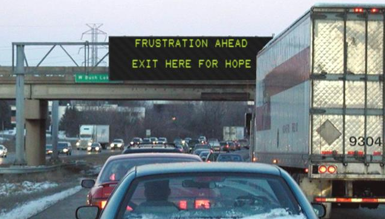
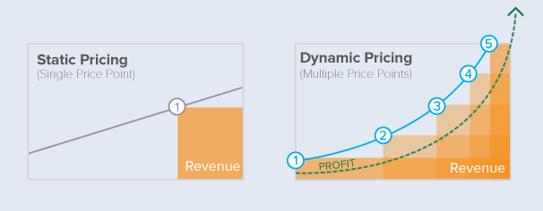

# Traffic, Congestion, and Dynamic Pricing {#pricing-traffic}

#### Keywords {-}

Dynamic pricing, traffic, congestion, jam

## The gridlock must end
<!--Check your comments, these headings should have been changed.-->
Over the past decade the United States has seen a sustained trend of individuals moving from the periphery into urban centers.  Unfortunately, the infastructure required to accomodate these demographic shifts has not been built, and as a result traffic has increased.  And while it may be easy to forget, traffic doesn't simply cause emotional and mental anguish!  In 2013 researchers estimated the cost of congestion to be $1,700 for a car owning household (INRIX).  

In the absense of massive infastructure investment, states and municipalities must begin to consider alternatives to reduce both the direct and indirect costs of traffic.  This proposal will outline both the rationale and methodology for taking a data science approach to dynamic pricing--charging cars a variable rate to drive on a highway--which has the potential to drastically modify the current urban landscape.

## Dynamic Pricing: The how and why

#### Why Dynamic Pricing
Dynamic pricing is not a new concept.  Anyone who has ever used Uber or purchased an airline ticket has experienced dynamic pricing whether they were aware of it or not.  Companies use dynamic pricing because it allows them to match demand with supply, ensuring they maximize profits.  

States and municipalities can take a similar approach, setting tolls so that the number of drivers willing to pay the toll at a given point in time (demand) matches the number of cars the highway can handle without traffic (supply).  Implementing this strategy would force price discovery, with individuals who are willing to pay more doing so, while providing those who could chooes to drive at a different time the option to save money.  If done correctly, this has the potential to significantly reduce traffic while raising money which can be used to fund infastructure projects.  Given the aformentioned costs of congestion, the ability for a city or state to reduce traffic is an extremely attractive value proposition.

#### But how will we know the correct price?

The million dollar question is not whether dynamic pricing should be used, but how to actually set toll prices to achieve the desired level of traffic.  To do this a complex model capable of predicting traffic given a variety of inputs--price, weather, day, time, etc.-- must be created.  And this is not a new idea; academics have considered this problem and attempted to analyze different methodologies and frameworks for years.  Additionally, several states have already begun testing versions of this strategy: In Texas the TEXpress program uses variable pricing in certain highways with the aim of maintaining an average traffic speed on 50 MPH ("LBJ TEXpress Lanes", 2018), and in Virginia public-private partnerships were formed to yield new variable pricing lanes on I95 an I495 ("Project Background",2018).  These programs demonstrate the feasibility and success of a dynamic approach, yet given the rapid advancements in data science and cloud computing there is opportunity to improve upon previous research and pricing models.  

#### Model Methodology

This project would begin by gathering publically available traffic, weather, demographic, pricing, and "event" (e.g. concert) data to build the initial model.  Two approaches would initially be tested, 1) a neural net, and 2) a boosted decision tree, with the more predictive model being used in production.  But that is only stage one!  The exciting part begins when states begin to implement this new model, as new data would feed back into the system, helping to improve the efficacy of the initial algorithm.  This in turn would serve as incentive for additional states and cities to adopt this offering, creating a positive feedback loop.  Because this project calls for ingesting large amounts of data, a robust storage and machine learning stack will be required that can easily scale.  Given the broad array of services offered, this project will utilize AWS, both for computation and data storage (S3).

## A not too distant future

Upon the completion of the model, states would have the ability to understand their expected  traffic vs. price function, and take steps to more appropriately allign reality with the state's societal and economic goals.  If implemented, the expectation would be an increase in economic activity, and a reduction in lost time.  Yet this proposal is not without flaws, primarily stemming from the potential inequity this solution might create.  Those at the bottom of the socio-economic ladder may find themselves in a position where they are unable to travel during certain times because the system is price prohibitive.  There are many potential solutions to this issue, including a cap and trade program, tax credits, and entitlement programs which would provide resources for travel to those in need, however identifying the correct approach is beyond the scope of this proposal.   In summary, we are witnessing the "tragedy of the commons" manifest itself in our highway system...but a data driven, dynamic pricing system will help correct preference misallignment, resulting in positive benefits for all stakeholders.

## Bibliography

LBJ TEXpress Lanes Overview and Maps. (n.d.). Retrieved February 06, 2018, from http://www.lbjtexpress.com/using-lbj-texpress-lanes/lbj-texpress-lanes-overview

Project Background. (n.d.). Retrieved February 06, 2018, from https://www.expresslanes.com/project-background

INRIX. (2014, October 14). INRIX. (2014, October 14). AMERICANS WILL WASTE $2.8 TRILLION ON TRAFFIC BY 2030 IF GRIDLOCK PERSISTS [Press release]. Retrieved February 6, 2018, from AMERICANS WILL WASTE $2.8 TRILLION ON TRAFFIC BY 2030 IF GRIDLOCK PERSISTS [Press release]. Retrieved October 6, 2018, from http://inrix.com/press-releases/americans-will-waste-2-8-trillion-on-traffic-by-2030-if-gridlock-persists/

Out With the Old, In With the New: Fixed vs. Dynamic Pricing. (2017, May 15). Retrieved March 12, 2018, from https://blog.wiser.com/old-new-fixed-vs-dynamic-pricing/

